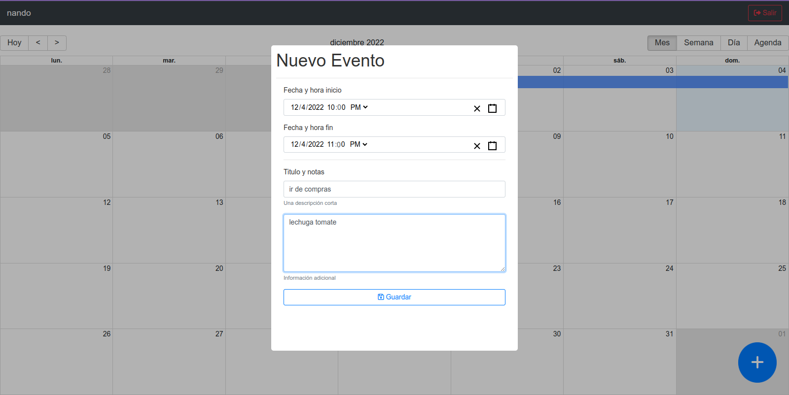

# Calendar APP - Proyecto Udemy

  

## Resumen

El objetivo principal de este sitio web es poder visualizar un calendario con todos los eventos o tareas a relizar por cada usuario que cree dicha tarea/evento.

## Funcionalidades

#### Como Usuario No Logeado:

-   Debo al menos logearme para ver el calendario

#### Como Usuario Logeado:

-   Puedo visualizar el calendario con todos los eventos que tengo creados.
-   Puedo crear un evento o tarea.
-   Puedo eliminar un evento o tarea.
-   Puedo editar un evento o tarea.
-   Puedo ver los detalles de un evento o tarea.
-   Puedo ver los eventos o tareas de otros usuarios.

## Tecnologías usadas

-   React.js
-   React-big-calendar
-   React-datetime-picker
-   React-modal
-   React-redux
-   React-router-dom
-   Node.js
-   Express.js
-   MongoDB
-   Mongoose
-   JWT
-   Bcryptjs

## Demo

Para probar o ver el sitio web ingresa al siguiente enlace:

-   Para visitar el sitio web [click aquí]().

Muchas gracias por visitar mi proyecto. Espero que les guste, y estoy abierto a cualquier tipo de feedback.
